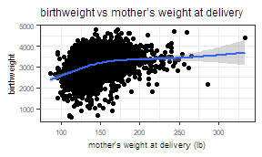
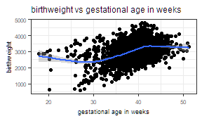
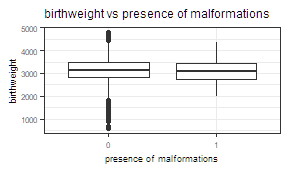
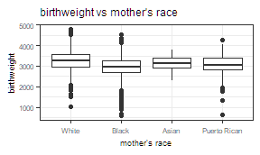
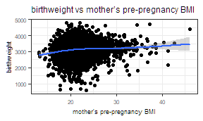
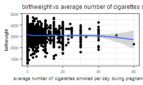

p8105\_hw6\_yc3242
================
Youn Kyeong Chang (uni\# yc3242)
November 18, 2018

### Problem 1

#### 1-(1)

:Create a city\_state variable (e.g. “Baltimore, MD”), and a binary variable indicating whether the homicide is solved. Omit cities Dallas, TX; Phoenix, AZ; and Kansas City, MO – these don’t report victim race. Also omit Tulsa, AL – this is a data entry mistake. Modifiy victim\_race to have categories white and non-white, with white as the reference category. Be sure that victim\_age is numeric.

``` r
homicide_data = 
  read_csv("https://raw.githubusercontent.com/washingtonpost/data-homicides/master/homicide-data.csv") %>% 
  janitor::clean_names() %>%  
  unite(city_state, city, state, sep = ",") %>%  
  mutate(hom_solved = ifelse((disposition == "Closed by arrest"), 1, 0)) %>% 
  filter(!city_state %in% c("Dallas,TX", "Phoenix,AZ", "Kansas City,MO", "Tulsa,AL"))  %>% 
  mutate(victim_race = 
           ifelse((victim_race == "White"), "white", "non-white"),
         victim_race = fct_relevel(victim_race, "white"),
         victim_age = as.numeric(victim_age)) 
## Parsed with column specification:
## cols(
##   uid = col_character(),
##   reported_date = col_integer(),
##   victim_last = col_character(),
##   victim_first = col_character(),
##   victim_race = col_character(),
##   victim_age = col_character(),
##   victim_sex = col_character(),
##   city = col_character(),
##   state = col_character(),
##   lat = col_double(),
##   lon = col_double(),
##   disposition = col_character()
## )
## Warning in evalq(as.numeric(victim_age), <environment>): NAs introduced by
## coercion
```

#### 1-(2)

For the city of Baltimore, MD, use the glm function to fit a logistic regression with resolved vs unresolved as the outcome and victim age, sex and race (as just defined) as predictors. Save the output of glm as an R object; apply the broom::tidy to this object; and obtain the estimate and confidence interval of the adjusted odds ratio for solving homicides comparing non-white victims to white victims keeping all other variables fixed.

``` r
balti_logistic = 
  homicide_data %>% 
  filter(city_state == "Baltimore,MD") %>% 
  glm(hom_solved ~ victim_age + victim_sex + victim_race, 
      data = ., family = binomial())

balti_logistic %>% 
  broom::tidy() %>% 
  mutate(OR = exp(estimate),
         lower_CI_OR = exp(estimate - 1.96*std.error),
         upper_CI_OR = exp(estimate + 1.96*std.error)) %>% 
  select(term, OR, lower_CI_OR, upper_CI_OR) %>% 
  filter(term == "victim_racenon-white") %>% 
  mutate(term = str_replace(term, "victim_racenon-white", "race:non-white")) %>%   knitr::kable(digits = 3)
```

| term           |     OR|  lower\_CI\_OR|  upper\_CI\_OR|
|:---------------|------:|--------------:|--------------:|
| race:non-white |  0.441|          0.313|           0.62|

#### 1-(3)

:Now run glm for each of the cities in your dataset, and extract the adjusted odds ratio (and CI) for solving homicides comparing non-white victims to white victims. Do this within a “tidy” pipeline, making use of purrr::map, list columns, and unnest as necessary to create a dataframe with estimated ORs and CIs for each city.

``` r
city_homicide_data = 
  homicide_data %>% 
  group_by(city_state) %>% 
  nest()

city_hom_logistic =
  function(df) {
    glm(hom_solved ~ victim_age + victim_sex + victim_race, 
      family = binomial(), data = df)
  }

city_homicide_logistic_results =
  city_homicide_data %>%
  mutate(model = map(data, city_hom_logistic),
        tidy_results = model %>% map(broom::tidy)) %>%
  select(city_state, tidy_results) %>%
  unnest() %>% 
  mutate(OR = exp(estimate),
         lower_CI_OR = exp(estimate - 1.96*std.error),
         upper_CI_OR = exp(estimate + 1.96*std.error)) %>% 
  select(city_state, term, OR, lower_CI_OR, upper_CI_OR) %>% 
  filter(term == "victim_racenon-white") %>% 
  mutate(term = str_replace(term, "victim_racenon-white", "race:non-white")) 

city_homicide_logistic_results 
## # A tibble: 47 x 5
##    city_state     term              OR lower_CI_OR upper_CI_OR
##    <chr>          <chr>          <dbl>       <dbl>       <dbl>
##  1 Albuquerque,NM race:non-white 0.741      0.451        1.22 
##  2 Atlanta,GA     race:non-white 0.753      0.432        1.31 
##  3 Baltimore,MD   race:non-white 0.441      0.313        0.620
##  4 Baton Rouge,LA race:non-white 0.668      0.313        1.43 
##  5 Birmingham,AL  race:non-white 1.04       0.615        1.76 
##  6 Boston,MA      race:non-white 0.115      0.0472       0.278
##  7 Buffalo,NY     race:non-white 0.390      0.213        0.715
##  8 Charlotte,NC   race:non-white 0.558      0.321        0.969
##  9 Chicago,IL     race:non-white 0.562      0.431        0.733
## 10 Cincinnati,OH  race:non-white 0.318      0.184        0.551
## # ... with 37 more rows
```

#### 1-(4)

Create a plot that shows the estimated ORs and CIs for each city. Organize cities according to estimated OR, and comment on the plot.

``` r
city_homicide_logistic_results %>% 
  mutate(city_state = fct_reorder(city_state, OR)) %>% 
  ggplot(aes(x = city_state, y = OR)) + 
  geom_point() + 
  geom_errorbar(aes(ymin = lower_CI_OR, ymax = upper_CI_OR), 
                color = "darkred") +
  coord_flip() +
  labs(
    title = "Odds ratio for solving homicides comparing non-white victims to white victims each city",
    subtitle = "Error bar using OR as center with 95% CIs",
    y = "Odds ratio",
    x = "City,State"
  ) +
  geom_hline(yintercept = 1.0, color = "blue") +
  theme(plot.title = element_text(size = 12),
        plot.subtitle = element_text(size = 9)) +
  theme_bw()
```


In terms of solving homicides, non-white people has lower odds compared to white people in cities whose OR is less than 1. For cities whose OR is greater than 1, non-white people has greater odds compared to white people. However, 95% confidence interval contains 1, it is not statistically significant at the significance level 0.05. Most cities have no significant result from this reasons. Among cities whose CI does not contain 1, Boston,MA has the lowest odds ratio and Las Vegas,NV has the highest odds ratio but still less than 1.

### Problem 2

In this probelm, you will analyze data gathered to understand the effects of several variables on a child’s birthweight. This dataset, available here, consists of roughly 4000 children and includes the following variables:

-   babysex: baby’s sex (male = 1, female = 2)
-   bhead: baby’s head circumference at birth (centimeters)
-   blength: baby’s length at birth (centimeteres)
-   bwt: baby’s birth weight (grams)
-   delwt: mother’s weight at delivery (pounds)
-   fincome: family monthly income (in hundreds, rounded)
-   frace: father’s race (1= White, 2 = Black, 3 = Asian, 4 = Puerto Rican, 8 = Other, 9 = Unknown)
-   gaweeks: gestational age in weeks
-   malform: presence of malformations that could affect weight (0 = absent, 1 = present)
-   menarche: mother’s age at menarche (years)
-   mheigth: mother’s height (inches)
-   momage: mother’s age at delivery (years)
-   mrace: mother’s race (1= White, 2 = Black, 3 = Asian, 4 = Puerto Rican, 8 = Other)
-   parity: number of live births prior to this pregnancy
-   pnumlbw: previous number of low birth weight babies
-   pnumgsa: number of prior small for gestational age babies
-   ppbmi: mother’s pre-pregnancy BMI
-   ppwt: mother’s pre-pregnancy weight (pounds)
-   smoken: average number of cigarettes smoked per day during pregnancy
-   wtgain: mother’s weight gain during pregnancy (pounds)

#### 2-(1)

Load and clean the data for regression analysis (i.e. convert numeric to factor where appropriate, check for missing data, etc.).

``` r
race_level = c("White", "Black", "Asian", "Puerto Rican", "Other")

birthweight_data = 
  read_csv("data/birthweight.csv") %>% 
  janitor::clean_names() %>% 
  mutate(babysex = as.factor(babysex),
         frace = case_when(
             frace == 1 ~ "White",
             frace == 2 ~ "Black",
             frace == 3 ~ "Asian",
             frace == 4 ~ "Puerto Rican",
             frace == 8 ~ "Other"),
         frace = fct_relevel(frace, race_level),
         malform = as.factor(malform),
         mrace = case_when(
             mrace == 1 ~ "White",
             mrace == 2 ~ "Black",
             mrace == 3 ~ "Asian",
             mrace == 4 ~ "Puerto Rican",
             mrace == 8 ~ "Other"),
         mrace = fct_relevel(mrace, race_level))
## Parsed with column specification:
## cols(
##   .default = col_integer(),
##   gaweeks = col_double(),
##   ppbmi = col_double(),
##   smoken = col_double()
## )
## See spec(...) for full column specifications.
## Warning: Unknown levels in `f`: Other

# Check missing data
sum(is.na(birthweight_data))
## [1] 0
```

#### 2-(2)

:Propose a regression model for birthweight. This model may be based on a hypothesized structure for the factors that underly birthweight, on a data-driven model-building process, or a combination of the two. Describe your modeling process and show a plot of model residuals against fitted values – use add\_predictions and add\_residuals in making this plot.

**1) Association: bwt vs variables**

``` r

## Association: bwt vs variables

birthweight_data %>% 
  ggplot(aes(x = babysex, y = bwt)) +
  geom_boxplot() +
  labs(subtitle = "birthweight vs baby’s sex") +
  theme(plot.subtitle = element_text(size = 9),
        axis.text.x = element_text(size = 6),
        axis.text.y = element_text(size = 6),
        axis.title.x = element_text(size = 7),
        axis.title.y = element_text(size = 7)) ## no effect 
```


``` r

birthweight_data %>% 
  ggplot(aes(x = bhead, y = bwt)) +
  geom_point() + 
  geom_smooth() +
  labs(subtitle = "birthweight vs baby’s head circumference at birth",
       y = "birthweight",
       x = "baby's head circumference (cm)") +
  theme(plot.subtitle = element_text(size = 9),
        axis.text.x = element_text(size = 6),
        axis.text.y = element_text(size = 6),
        axis.title.x = element_text(size = 7),
        axis.title.y = element_text(size = 7)) ## strong 
## `geom_smooth()` using method = 'gam' and formula 'y ~ s(x, bs = "cs")'
```


``` r
  
birthweight_data %>% 
  ggplot(aes(x = blength, y = bwt)) +
  geom_point() + 
  geom_smooth() +
  labs(subtitle = "birthweight vs baby’s length at birth (cm)",
       y = "birthweight",
       x = "baby’s length at birth (cm)") +
  theme(plot.subtitle = element_text(size = 9),
        axis.text.x = element_text(size = 6),
        axis.text.y = element_text(size = 6),
        axis.title.x = element_text(size = 7),
        axis.title.y = element_text(size = 7)) ## strong
## `geom_smooth()` using method = 'gam' and formula 'y ~ s(x, bs = "cs")'
```


``` r

birthweight_data %>% 
  ggplot(aes(x = delwt, y = bwt)) +
  geom_point() + 
  geom_smooth() +
  labs(subtitle = "birthweight vs mother’s weight at delivery",
       y = "birthweight",
       x = "mother’s weight at delivery (lb)") +
  theme(plot.subtitle = element_text(size = 9),
        axis.text.x = element_text(size = 6),
        axis.text.y = element_text(size = 6),
        axis.title.x = element_text(size = 7),
        axis.title.y = element_text(size = 7)) ## week
## `geom_smooth()` using method = 'gam' and formula 'y ~ s(x, bs = "cs")'
```



``` r

birthweight_data %>% 
  ggplot(aes(x = fincome, y = bwt)) +
  geom_point() + 
  geom_smooth() +
  labs(subtitle = "birthweight vs family monthly income",
       y = "birthweight",
       x = "family monthly income") +
  theme(plot.subtitle = element_text(size = 9),
        axis.text.x = element_text(size = 6),
        axis.text.y = element_text(size = 6),
        axis.title.x = element_text(size = 7),
        axis.title.y = element_text(size = 7)) ## no effect
## `geom_smooth()` using method = 'gam' and formula 'y ~ s(x, bs = "cs")'
```


``` r

birthweight_data %>% 
  ggplot(aes(x = frace, y = bwt)) +
  geom_boxplot() +
  labs(subtitle = "birthweight vs father's race",
       y = "birthweight",
       x = "father's race") +
  theme(plot.subtitle = element_text(size = 9),
        axis.text.x = element_text(size = 6),
        axis.text.y = element_text(size = 6),
        axis.title.x = element_text(size = 7),
        axis.title.y = element_text(size = 7)) ## no effect
```


``` r

birthweight_data %>% 
  ggplot(aes(x = gaweeks, y = bwt)) +
  geom_point() + 
  geom_smooth() +
  labs(subtitle = "birthweight vs gestational age in weeks",
       y = "birthweight",
       x = "gestational age in weeks") +
  theme(plot.subtitle = element_text(size = 9),
        axis.text.x = element_text(size = 6),
        axis.text.y = element_text(size = 6),
        axis.title.x = element_text(size = 7),
        axis.title.y = element_text(size = 7)) ## week
## `geom_smooth()` using method = 'gam' and formula 'y ~ s(x, bs = "cs")'
```



``` r

birthweight_data %>% 
  ggplot(aes(x = malform, y = bwt)) +
  geom_boxplot() +
  labs(subtitle = "birthweight vs presence of malformations",
       y = "birthweight",
       x = "presence of malformations") +
  theme(plot.subtitle = element_text(size = 9),
        axis.text.x = element_text(size = 6),
        axis.text.y = element_text(size = 6),
        axis.title.x = element_text(size = 7),
        axis.title.y = element_text(size = 7)) ## no effect
```



``` r

birthweight_data %>% 
  ggplot(aes(x = menarche, y = bwt)) +
  geom_point() + 
  geom_smooth() +
  labs(subtitle = "birthweight vs mother’s age at menarche",
       y = "birthweight",
       x = "mother’s age at menarche (years)") +
  theme(plot.subtitle = element_text(size = 9),
        axis.text.x = element_text(size = 6),
        axis.text.y = element_text(size = 6),
        axis.title.x = element_text(size = 7),
        axis.title.y = element_text(size = 7)) ## no effect
## `geom_smooth()` using method = 'gam' and formula 'y ~ s(x, bs = "cs")'
```


``` r

birthweight_data %>% 
  ggplot(aes(x = mheight, y = bwt)) +
  geom_point() + 
  geom_smooth() +
  labs(subtitle = "birthweight vs mother’s height",
       y = "birthweight",
       x = "mother’s height (inches)") +
  theme(plot.subtitle = element_text(size = 9),
        axis.text.x = element_text(size = 6),
        axis.text.y = element_text(size = 6),
        axis.title.x = element_text(size = 7),
        axis.title.y = element_text(size = 7)) ## no effect
## `geom_smooth()` using method = 'gam' and formula 'y ~ s(x, bs = "cs")'
```


``` r

birthweight_data %>% 
  ggplot(aes(x = momage, y = bwt)) +
  geom_point() + 
  geom_smooth() +
  labs(subtitle = "birthweight vs mother’s age at delivery",
       y = "birthweight",
       x = "mother’s age at delivery (years)") +
  theme(plot.subtitle = element_text(size = 9),
        axis.text.x = element_text(size = 6),
        axis.text.y = element_text(size = 6),
        axis.title.x = element_text(size = 7),
        axis.title.y = element_text(size = 7)) ## no effect
## `geom_smooth()` using method = 'gam' and formula 'y ~ s(x, bs = "cs")'
```


``` r

birthweight_data %>% 
  ggplot(aes(x = mrace, y = bwt)) +
  geom_boxplot() +
  labs(subtitle = "birthweight vs mother's race",
       y = "birthweight",
       x = "mother's race") +
  theme(plot.subtitle = element_text(size = 9),
        axis.text.x = element_text(size = 6),
        axis.text.y = element_text(size = 6),
        axis.title.x = element_text(size = 7),
        axis.title.y = element_text(size = 7)) ## week effect
```



``` r

birthweight_data %>% 
  ggplot(aes(x = parity, y = bwt)) +
  geom_point() +
  labs(subtitle = "birthweight vs number of live births prior to this pregnancy",
       y = "birthweight",
       x = "number of live births prior to this pregnancy") +
  theme(plot.subtitle = element_text(size = 9),
        axis.text.x = element_text(size = 6),
        axis.text.y = element_text(size = 6),
        axis.title.x = element_text(size = 7),
        axis.title.y = element_text(size = 7))  ## no effect
```


``` r

birthweight_data %>% 
  ggplot(aes(x = pnumlbw, y = bwt)) +
  geom_point() +
  labs(subtitle = "birthweight vs previous number of low birth weight babies",
       y = "birthweight",
       x = "previous number of low birth weight babies") +
  theme(plot.subtitle = element_text(size = 9),
        axis.text.x = element_text(size = 6),
        axis.text.y = element_text(size = 6),
        axis.title.x = element_text(size = 7),
        axis.title.y = element_text(size = 7))  ## no effect
```


``` r

birthweight_data %>% 
  ggplot(aes(x = pnumsga, y = bwt)) +
  geom_point() +
  labs(subtitle = "birthweight vs number of prior small for gestational age babies",
       y = "birthweight",
       x = "number of prior small for gestational age babies") +
  theme(plot.subtitle = element_text(size = 9),
        axis.text.x = element_text(size = 6),
        axis.text.y = element_text(size = 6),
        axis.title.x = element_text(size = 7),
        axis.title.y = element_text(size = 7))  ## no effect
```


``` r

birthweight_data %>% 
  ggplot(aes(x = ppbmi, y = bwt)) +
  geom_point() + 
  geom_smooth() +
  labs(subtitle = "birthweight vs mother’s pre-pregnancy BMI",
       y = "birthweight",
       x = "mother’s pre-pregnancy BMI") +
  theme(plot.subtitle = element_text(size = 9),
        axis.text.x = element_text(size = 6),
        axis.text.y = element_text(size = 6),
        axis.title.x = element_text(size = 7),
        axis.title.y = element_text(size = 7)) ## week effect
## `geom_smooth()` using method = 'gam' and formula 'y ~ s(x, bs = "cs")'
```



``` r

birthweight_data %>% 
  ggplot(aes(x = ppwt, y = bwt)) +
  geom_point() + 
  geom_smooth() +
  labs(subtitle = "birthweight vs mother’s pre-pregnancy weight ",
       y = "birthweight",
       x = "mother’s pre-pregnancy weight (lb)") +
  theme(plot.subtitle = element_text(size = 9),
        axis.text.x = element_text(size = 6),
        axis.text.y = element_text(size = 6),
        axis.title.x = element_text(size = 7),
        axis.title.y = element_text(size = 7)) ## week effect
## `geom_smooth()` using method = 'gam' and formula 'y ~ s(x, bs = "cs")'
```


``` r

birthweight_data %>% 
  ggplot(aes(x = smoken, y = bwt)) +
  geom_point() + 
  geom_smooth() +
  labs(subtitle = "birthweight vs average number of cigarettes smoked per day during pregnancy",
       y = "birthweight",
       x = "average number of cigarettes smoked per day during pregnancy") +
  theme(plot.subtitle = element_text(size = 9),
        axis.text.x = element_text(size = 6),
        axis.text.y = element_text(size = 6),
        axis.title.x = element_text(size = 7),
        axis.title.y = element_text(size = 7)) ## no effect
## `geom_smooth()` using method = 'gam' and formula 'y ~ s(x, bs = "cs")'
```



``` r

birthweight_data %>% 
  ggplot(aes(x = wtgain, y = bwt)) +
  geom_point() + 
  geom_smooth() +
  labs(subtitle = "birthweight vs mother’s weight gain during pregnancy",
       y = "birthweight",
       x = "mother’s weight gain during pregnancy (lb)") +
  theme(plot.subtitle = element_text(size = 9),
        axis.text.x = element_text(size = 6),
        axis.text.y = element_text(size = 6),
        axis.title.x = element_text(size = 7),
        axis.title.y = element_text(size = 7)) ## week effect
## `geom_smooth()` using method = 'gam' and formula 'y ~ s(x, bs = "cs")'
```


With regard to association between outcome(birthweight) and covariates, in case of categorical covariates, boxplots are used and in case of continuous covariates, I looked at the scatter plot with loess smoother. As a result, I categorized covariates with the level of association with birthweight: - **strong association**: bhead, blength - **week association**: delwt, gaweeks, mrace, ppbmi, ppwt, wtgain - **no association**: babysex, fincome, frace, malform, menarche, mheight, momage, parity, pnumlbw, pnumbsga, smoken

**2) Model comparison: Hypothesis testing**

``` r
## strong effect variables only
fit_str = 
  birthweight_data %>%
  select(bwt, bhead, blength) %>% 
  lm(bwt ~., data = .)

## strong + week effect variables 
fit_str_week =  
  birthweight_data %>% 
  select(bwt, bhead, blength, delwt, gaweeks, mrace, ppbmi, ppwt, wtgain) %>% 
  lm(bwt ~., data = .)
summary(fit_str_week)
## 
## Call:
## lm(formula = bwt ~ ., data = .)
## 
## Residuals:
##      Min       1Q   Median       3Q      Max 
## -1100.59  -184.87    -0.57   178.16  2391.83 
## 
## Coefficients: (1 not defined because of singularities)
##                     Estimate Std. Error t value Pr(>|t|)    
## (Intercept)       -5726.9220    99.1903 -57.737  < 2e-16 ***
## bhead               131.1931     3.4312  38.236  < 2e-16 ***
## blength              76.0572     2.0300  37.466  < 2e-16 ***
## delwt                 3.9240     0.3953   9.928  < 2e-16 ***
## gaweeks              11.4072     1.4638   7.793 8.16e-15 ***
## mraceBlack         -125.0348     8.9765 -13.929  < 2e-16 ***
## mraceAsian          -58.7046    42.6085  -1.378  0.16835    
## mracePuerto Rican   -90.2564    19.1604  -4.711 2.55e-06 ***
## ppbmi                -9.2246     2.5936  -3.557  0.00038 ***
## ppwt                 -0.9612     0.5711  -1.683  0.09240 .  
## wtgain                    NA         NA      NA       NA    
## ---
## Signif. codes:  0 '***' 0.001 '**' 0.01 '*' 0.05 '.' 0.1 ' ' 1
## 
## Residual standard error: 275.1 on 4332 degrees of freedom
## Multiple R-squared:  0.712,  Adjusted R-squared:  0.7114 
## F-statistic:  1190 on 9 and 4332 DF,  p-value: < 2.2e-16

anova(fit_str_week, fit_str) %>% 
  broom::tidy() %>% 
  knitr::kable() 
## Warning: Unknown or uninitialised column: 'term'.
```

|  res.df|        rss|   df|      sumsq|  statistic|  p.value|
|-------:|----------:|----:|----------:|----------:|--------:|
|    4332|  327947226|   NA|         NA|         NA|       NA|
|    4339|  362831534|   -7|  -34884307|   65.82889|        0|

After skimming the association between birthweight and each explanatory variables, I fit two linear models as follows: - 1) birthweight with variables categorized in strong association. - 2) birthweight with variables categorized in strong and week association. As a result of model comparison, the more complex model (model 2)) is significantly better than the simpler model (model 1)) at the significance level 0.05.

**3) plot of model residuals against fitted values**

``` r
birthweight_data %>% 
  add_predictions(fit_str_week) %>% 
  add_residuals(fit_str_week) %>% 
  ggplot(aes(x = pred, y = resid)) +
  geom_point(alpha = .25) +
  geom_smooth(se = FALSE) +
  labs(title = "Model residuals vs fitted values",
       x = "Predicted value",
       y = "Residuals")
## Warning in predict.lm(model, data): prediction from a rank-deficient fit
## may be misleading

## Warning in predict.lm(model, data): prediction from a rank-deficient fit
## may be misleading
## `geom_smooth()` using method = 'gam' and formula 'y ~ s(x, bs = "cs")'
```


This model is poor if birthweight is low since residual is much greater than 0 but model fits well if birthweight is over 2000 with residuals close 0.

#### 2-(3)

Compare your model to two others: One using length at birth and gestational age as predictors (main effects only) One using head circumference, length, sex, and all interactions (including the three-way interaction) between these.

``` r
fit_alt_main =
  birthweight_data %>%
  select(bwt, blength, gaweeks) %>% 
  lm(bwt ~., data = .)

fit_alt_int =
  lm(bwt ~ bhead*blength + bhead*babysex + blength*babysex, 
     data = birthweight_data)

crossv_mc(birthweight_data, 100) %>% 
  mutate(str_week      = map(train, ~lm(bwt ~ bhead + blength + delwt + gaweeks + mrace + ppbmi + ppwt + wtgain, data = .x)),
         alt_main = map(train, ~lm(bwt ~ blength + gaweeks, data = .x)),
         alt_int  = map(train, ~lm(bwt ~ bhead*blength + bhead*babysex +
                                     blength*babysex, data = .x))) %>% 
  mutate(rmse_str_week = map2_dbl(str_week, test, ~rmse(model = .x, data = .y)),
         rmse_alt_main = map2_dbl(alt_main, test, ~rmse(model = .x, data = .y)),
         rmse_alt_int = map2_dbl(alt_int, test, ~rmse(model = .x, data = .y))) %>% 
  select(starts_with("rmse")) %>% 
  gather(key = model, value = rmse) %>% 
  mutate(model = str_replace(model, "rmse_", ""),
         model = fct_inorder(model)) %>% 
  ggplot(aes(x = model, y = rmse)) + geom_violin() +
  labs(title = "root mean squared errors (RMSEs) in each models")
```


Based on this result, final model (str\_week) is improved in predictive accuracy than main effect only model and a model including three-way interaction.
