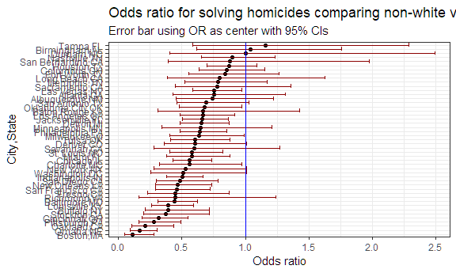
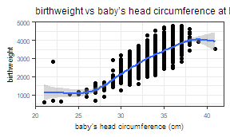
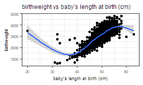
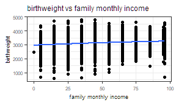
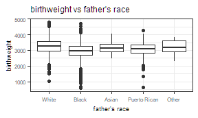
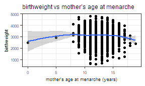
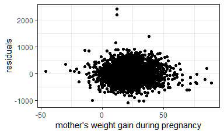

p8105\_hw6\_yc3242
================
Youn Kyeong Chang (uni\# yc3242)
November 18, 2018

### Problem 1

#### 1-(1)

:Create a city\_state variable (e.g. “Baltimore, MD”), and a binary variable indicating whether the homicide is solved. Omit cities Dallas, TX; Phoenix, AZ; and Kansas City, MO – these don’t report victim race. Also omit Tulsa, AL – this is a data entry mistake. Modifiy victim\_race to have categories white and non-white, with white as the reference category. Be sure that victim\_age is numeric.

``` r
homicide_data = 
  read_csv("https://raw.githubusercontent.com/washingtonpost/data-homicides/master/homicide-data.csv") %>% 
  janitor::clean_names() %>%  
  unite(city_state, city, state, sep = ",") %>%  
  mutate(hom_solved = ifelse((disposition == "Closed by arrest"), 1, 0)) %>% 
  filter(!city_state %in% c("Dallas,TX", "Phoenix,AZ", "Kansas City,MO", "Tulsa,AL"))  %>% 
  mutate(victim_race = 
           ifelse((victim_race == "White"), "white", "non-white"),
         victim_race = fct_relevel(victim_race, "white"),
         victim_age = as.numeric(victim_age)) 
## Parsed with column specification:
## cols(
##   uid = col_character(),
##   reported_date = col_integer(),
##   victim_last = col_character(),
##   victim_first = col_character(),
##   victim_race = col_character(),
##   victim_age = col_character(),
##   victim_sex = col_character(),
##   city = col_character(),
##   state = col_character(),
##   lat = col_double(),
##   lon = col_double(),
##   disposition = col_character()
## )
## Warning in evalq(as.numeric(victim_age), <environment>): NAs introduced by
## coercion
```

#### 1-(2)

For the city of Baltimore, MD, use the glm function to fit a logistic regression with resolved vs unresolved as the outcome and victim age, sex and race (as just defined) as predictors. Save the output of glm as an R object; apply the broom::tidy to this object; and obtain the estimate and confidence interval of the adjusted odds ratio for solving homicides comparing non-white victims to white victims keeping all other variables fixed.

``` r
balti_logistic = 
  homicide_data %>% 
  filter(city_state == "Baltimore,MD") %>% 
  glm(hom_solved ~ victim_age + victim_sex + victim_race, 
      data = ., family = binomial())

balti_logistic %>% 
  broom::tidy() %>% 
  mutate(OR = exp(estimate),
         lower_CI_OR = exp(estimate - 1.96*std.error),
         upper_CI_OR = exp(estimate + 1.96*std.error)) %>% 
  select(term, OR, lower_CI_OR, upper_CI_OR) %>% 
  filter(term == "victim_racenon-white") %>% 
  mutate(term = str_replace(term, "victim_racenon-white", "race:non-white")) %>%   knitr::kable()
```

| term           |        OR|  lower\_CI\_OR|  upper\_CI\_OR|
|:---------------|---------:|--------------:|--------------:|
| race:non-white |  0.440608|      0.3129079|      0.6204234|

#### 1-(3)

:Now run glm for each of the cities in your dataset, and extract the adjusted odds ratio (and CI) for solving homicides comparing non-white victims to white victims. Do this within a “tidy” pipeline, making use of purrr::map, list columns, and unnest as necessary to create a dataframe with estimated ORs and CIs for each city.

``` r
city_homicide_data = 
  homicide_data %>% 
  group_by(city_state) %>% 
  nest()

city_hom_logistic =
  function(df) {
    glm(hom_solved ~ victim_age + victim_sex + victim_race, 
      family = binomial(), data = df)
  }

city_homicide_logistic_results =
  city_homicide_data %>%
  mutate(model = map(data, city_hom_logistic),
        tidy_results = model %>% map(broom::tidy)) %>%
  select(city_state, tidy_results) %>%
  unnest() %>% 
  mutate(OR = exp(estimate),
         lower_CI_OR = exp(estimate - 1.96*std.error),
         upper_CI_OR = exp(estimate + 1.96*std.error)) %>% 
  select(city_state, term, OR, lower_CI_OR, upper_CI_OR) %>% 
  filter(term == "victim_racenon-white") %>% 
  mutate(term = str_replace(term, "victim_racenon-white", "race:non-white")) 

city_homicide_logistic_results 
## # A tibble: 47 x 5
##    city_state     term              OR lower_CI_OR upper_CI_OR
##    <chr>          <chr>          <dbl>       <dbl>       <dbl>
##  1 Albuquerque,NM race:non-white 0.741      0.451        1.22 
##  2 Atlanta,GA     race:non-white 0.753      0.432        1.31 
##  3 Baltimore,MD   race:non-white 0.441      0.313        0.620
##  4 Baton Rouge,LA race:non-white 0.668      0.313        1.43 
##  5 Birmingham,AL  race:non-white 1.04       0.615        1.76 
##  6 Boston,MA      race:non-white 0.115      0.0472       0.278
##  7 Buffalo,NY     race:non-white 0.390      0.213        0.715
##  8 Charlotte,NC   race:non-white 0.558      0.321        0.969
##  9 Chicago,IL     race:non-white 0.562      0.431        0.733
## 10 Cincinnati,OH  race:non-white 0.318      0.184        0.551
## # ... with 37 more rows
```

#### 1-(4)

Create a plot that shows the estimated ORs and CIs for each city. Organize cities according to estimated OR, and comment on the plot.

``` r
city_homicide_logistic_results %>% 
  mutate(city_state = fct_reorder(city_state, OR)) %>% 
  ggplot(aes(x = city_state, y = OR)) + 
  geom_point() + 
  geom_errorbar(aes(ymin = lower_CI_OR, ymax = upper_CI_OR), 
                color = "darkred") +
  coord_flip() +
  labs(
    title = "Odds ratio for solving homicides comparing non-white victims to white victims each city",
    subtitle = "Error bar using OR as center with 95% CIs",
    y = "Odds ratio",
    x = "City,State"
  ) +
  theme(plot.title = element_text(size = 12),
        plot.subtitle = element_text(size = 9)) +
  theme_bw()
```



In terms of solving homicides, non-white people has lower odds compared to white people in cities whose OR is less than 1. For cities whose OR is greater than 1, non-white people has greater odds compared to white people. However, if 95% confidence interval contains 1, it is not statistically significant at the significance level 0.05.

### Problem 2

In this probelm, you will analyze data gathered to understand the effects of several variables on a child’s birthweight. This dataset, available here, consists of roughly 4000 children and includes the following variables:

-   babysex: baby’s sex (male = 1, female = 2)
-   bhead: baby’s head circumference at birth (centimeters)
-   blength: baby’s length at birth (centimeteres)
-   bwt: baby’s birth weight (grams)
-   delwt: mother’s weight at delivery (pounds)
-   fincome: family monthly income (in hundreds, rounded)
-   frace: father’s race (1= White, 2 = Black, 3 = Asian, 4 = Puerto Rican, 8 = Other, 9 = Unknown)
-   gaweeks: gestational age in weeks
-   malform: presence of malformations that could affect weight (0 = absent, 1 = present)
-   menarche: mother’s age at menarche (years)
-   mheigth: mother’s height (inches)
-   momage: mother’s age at delivery (years)
-   mrace: mother’s race (1= White, 2 = Black, 3 = Asian, 4 = Puerto Rican, 8 = Other)
-   parity: number of live births prior to this pregnancy
-   pnumlbw: previous number of low birth weight babies
-   pnumgsa: number of prior small for gestational age babies
-   ppbmi: mother’s pre-pregnancy BMI
-   ppwt: mother’s pre-pregnancy weight (pounds)
-   smoken: average number of cigarettes smoked per day during pregnancy
-   wtgain: mother’s weight gain during pregnancy (pounds)

#### 2-(1)

Load and clean the data for regression analysis (i.e. convert numeric to factor where appropriate, check for missing data, etc.). \#?????????????????????frace, mrace fct order??????

``` r
birthweight_data = 
  read_csv("data/birthweight.csv") %>% 
  janitor::clean_names() %>% 
  mutate(babysex = as.factor(babysex),
         frace = as.factor(frace),
         frace = case_when(
             frace == 1 ~ "White",
             frace == 2 ~ "Black",
             frace == 3 ~ "Asian",
             frace == 4 ~ "Puerto Rican",
             frace == 8 ~ "Other"),
         malform = as.factor(malform),
         mrace = as.factor(mrace))
## Parsed with column specification:
## cols(
##   .default = col_integer(),
##   gaweeks = col_double(),
##   ppbmi = col_double(),
##   smoken = col_double()
## )
## See spec(...) for full column specifications.
```

#### 2-(2)

:Propose a regression model for birthweight. This model may be based on a hypothesized structure for the factors that underly birthweight, on a data-driven model-building process, or a combination of the two. Describe your modeling process and show a plot of model residuals against fitted values – use add\_predictions and add\_residuals in making this plot.

**1) Association: bwt vs variables**

``` r

## Association: bwt vs variables

birthweight_data %>% 
  ggplot(aes(x = babysex, y = bwt)) +
  geom_point() ## week 
```


``` r

birthweight_data %>% 
  ggplot(aes(x = bhead, y = bwt)) +
  geom_point() + geom_smooth() ## strong 
## `geom_smooth()` using method = 'gam' and formula 'y ~ s(x, bs = "cs")'
```



``` r
  
birthweight_data %>% 
  ggplot(aes(x = blength, y = bwt)) +
  geom_point() + geom_smooth() ## strong
## `geom_smooth()` using method = 'gam' and formula 'y ~ s(x, bs = "cs")'
```



``` r

birthweight_data %>% 
  ggplot(aes(x = delwt, y = bwt)) +
  geom_point() + geom_smooth() ## week
## `geom_smooth()` using method = 'gam' and formula 'y ~ s(x, bs = "cs")'
```


``` r

birthweight_data %>% 
  ggplot(aes(x = fincome, y = bwt)) +
  geom_point() + geom_smooth() ## no effect
## `geom_smooth()` using method = 'gam' and formula 'y ~ s(x, bs = "cs")'
```



``` r

birthweight_data %>% 
  ggplot(aes(x = frace, y = bwt)) +
  geom_point() ## week effect
```



``` r

birthweight_data %>% 
  ggplot(aes(x = gaweeks, y = bwt)) +
  geom_point() + geom_smooth() ## week
## `geom_smooth()` using method = 'gam' and formula 'y ~ s(x, bs = "cs")'
```


``` r

birthweight_data %>% 
  ggplot(aes(x = malform, y = bwt)) +
  geom_point() ## week effect
```


``` r

birthweight_data %>% 
  ggplot(aes(x = menarche, y = bwt)) +
  geom_point() + geom_smooth() ## no effect
## `geom_smooth()` using method = 'gam' and formula 'y ~ s(x, bs = "cs")'
```



``` r

birthweight_data %>% 
  ggplot(aes(x = mheight, y = bwt)) +
  geom_point() + geom_smooth() ## no effect
## `geom_smooth()` using method = 'gam' and formula 'y ~ s(x, bs = "cs")'
```


``` r

birthweight_data %>% 
  ggplot(aes(x = momage, y = bwt)) +
  geom_point() + geom_smooth() ## no effect
## `geom_smooth()` using method = 'gam' and formula 'y ~ s(x, bs = "cs")'
```


``` r

birthweight_data %>% 
  ggplot(aes(x = mrace, y = bwt)) +
  geom_point() ## week effect
```


``` r

birthweight_data %>% 
  ggplot(aes(x = parity, y = bwt)) +
  geom_point() + geom_smooth() ## no effect
## `geom_smooth()` using method = 'gam' and formula 'y ~ s(x, bs = "cs")'
## Warning: Computation failed in `stat_smooth()`:
## x has insufficient unique values to support 10 knots: reduce k.
```


``` r

birthweight_data %>% 
  ggplot(aes(x = pnumlbw, y = bwt)) +
  geom_point() + geom_smooth() ## no effect
## `geom_smooth()` using method = 'gam' and formula 'y ~ s(x, bs = "cs")'
```


``` r

birthweight_data %>% 
  ggplot(aes(x = pnumsga, y = bwt)) +
  geom_point() + geom_smooth() ## no effect
## `geom_smooth()` using method = 'gam' and formula 'y ~ s(x, bs = "cs")'
```


``` r

birthweight_data %>% 
  ggplot(aes(x = ppwt, y = bwt)) +
  geom_point() + geom_smooth() ## week effect
## `geom_smooth()` using method = 'gam' and formula 'y ~ s(x, bs = "cs")'
```


``` r

birthweight_data %>% 
  ggplot(aes(x = smoken, y = bwt)) +
  geom_point() + geom_smooth() ## no effect
## `geom_smooth()` using method = 'gam' and formula 'y ~ s(x, bs = "cs")'
```


``` r

birthweight_data %>% 
  ggplot(aes(x = wtgain, y = bwt)) +
  geom_point() + geom_smooth() ## week effect
## `geom_smooth()` using method = 'gam' and formula 'y ~ s(x, bs = "cs")'
```


**2) Model comparison: Hypothesis testing**

``` r
## strong effect variables only
fit_null = 
  birthweight_data %>%
  select(bwt, bhead, blength) %>% 
  lm(bwt ~., data = .)

## strong + week effect variables 
fit_alt =  
  birthweight_data %>% 
  select(bwt, babysex, bhead, blength, delwt, frace, gaweeks, malform, mrace, ppbmi, ppwt, wtgain) %>% 
  lm(bwt ~., data = .)

anova(fit_null, fit_alt) %>% 
  broom::tidy() %>% 
  knitr::kable() 
## Warning: Unknown or uninitialised column: 'term'.
```

|  res.df|        rss|   df|     sumsq|  statistic|  p.value|
|-------:|----------:|----:|---------:|----------:|--------:|
|    4339|  362831534|   NA|        NA|         NA|       NA|
|    4326|  326772684|   13|  36058849|   36.72056|        0|

First, I looked at the association between outcome variable(birthweight) and each explanatory variable by scatterplot. After skimming, I fit the linear model with variables which are considered strongly associated with outcome variable based on the scatterplots. And then, I added variables which has shown week association with outcome variable. As a result of hypothesis testing, the more complex model is significantly better than the simpler model at the significance level 0.05.

**3) plot of model residuals against fitted values**

``` r
birthweight_data %>% 
  add_residuals(fit_alt) %>% 
  mutate(babysex = ifelse((babysex == 1), "male", "female")) %>% 
  ggplot(aes(x = babysex, y = resid)) + 
  geom_violin(aes(fill = babysex), alpha = .5) +
  labs(x = "baby sex",
       y = "residuals") +
  viridis::scale_fill_viridis(
    discrete = TRUE
    )
## Warning in predict.lm(model, data): prediction from a rank-deficient fit
## may be misleading
```


``` r

birthweight_data %>% 
  add_residuals(fit_alt) %>% 
  ggplot(aes(x = bhead, y = resid)) + 
  geom_point() +
  labs(x = "baby's head circumference at birth (cm)",
       y = "residuals") 
## Warning in predict.lm(model, data): prediction from a rank-deficient fit
## may be misleading
```


``` r

birthweight_data %>% 
  add_residuals(fit_alt) %>% 
  ggplot(aes(x = blength, y = resid)) + 
  geom_point() +
  labs(x = "baby's length at birth (cm)",
       y = "residuals") 
## Warning in predict.lm(model, data): prediction from a rank-deficient fit
## may be misleading
```


``` r

birthweight_data %>% 
  add_residuals(fit_alt) %>% 
  ggplot(aes(x = delwt, y = resid)) + 
  geom_point() +
  labs(x = "mother's weight at delivery(lb)",
       y = "residuals") 
## Warning in predict.lm(model, data): prediction from a rank-deficient fit
## may be misleading
```


``` r

birthweight_data %>% 
  add_residuals(fit_alt) %>% 
  ggplot(aes(x = frace, y = resid)) + 
  geom_violin(aes(fill = frace), alpha = .5) +
  labs(x = "father's race",
       y = "residuals") +
  viridis::scale_fill_viridis(
    discrete = TRUE
    )
## Warning in predict.lm(model, data): prediction from a rank-deficient fit
## may be misleading
```


``` r

birthweight_data %>% 
  add_residuals(fit_alt) %>% 
  ggplot(aes(x = gaweeks, y = resid)) + 
  geom_point() +
  labs(x = "gestational ages in weeks",
       y = "residuals")
## Warning in predict.lm(model, data): prediction from a rank-deficient fit
## may be misleading
```


``` r

birthweight_data %>% 
  add_residuals(fit_alt) %>% 
  mutate(malform = ifelse((malform == 0), "absent", "present")) %>% 
  ggplot(aes(x = malform, y = resid)) + 
  geom_violin(aes(fill = malform), alpha = .5) +
  labs(x = "presence of malformations",
       y = "residuals") +
  viridis::scale_fill_viridis(
    discrete = TRUE
    )
## Warning in predict.lm(model, data): prediction from a rank-deficient fit
## may be misleading
```


``` r

birthweight_data %>% 
  add_residuals(fit_alt) %>% 
  ggplot(aes(x = mrace, y = resid)) + 
  geom_violin(aes(fill = mrace), alpha = .5) +
  labs(x = "mather's race",
       y = "residuals") +
  viridis::scale_fill_viridis(
    discrete = TRUE
    )
## Warning in predict.lm(model, data): prediction from a rank-deficient fit
## may be misleading
```


``` r

birthweight_data %>% 
  add_residuals(fit_alt) %>% 
  ggplot(aes(x = ppbmi, y = resid)) + 
  geom_point() +
  labs(x = "mother's pre-pregnancy BMI",
       y = "residuals")
## Warning in predict.lm(model, data): prediction from a rank-deficient fit
## may be misleading
```


``` r

birthweight_data %>% 
  add_residuals(fit_alt) %>% 
  ggplot(aes(x = ppwt, y = resid)) + 
  geom_point() +
  labs(x = "mother's pre-pregnancy weight(lb)",
       y = "residuals")
## Warning in predict.lm(model, data): prediction from a rank-deficient fit
## may be misleading
```


``` r

birthweight_data %>% 
  add_residuals(fit_alt) %>% 
  ggplot(aes(x = wtgain, y = resid)) + 
  geom_point() +
  labs(x = "mother's weight gain during pregnancy",
       y = "residuals")
## Warning in predict.lm(model, data): prediction from a rank-deficient fit
## may be misleading
```



#### 2-(3)????????????????????????????????

Compare your model to two others: One using length at birth and gestational age as predictors (main effects only) One using head circumference, length, sex, and all interactions (including the three-way interaction) between these. Make this comparison in terms of the cross-validated prediction error; use crossv\_mc and functions in purrr as appropriate.

``` r
fit_alt_main =
  birthweight_data %>%
  select(bwt, blength, gaweeks) %>% 
  lm(bwt ~., data = .)

fit_alt_int =
  lm(bwt ~ bhead*blength + bhead*babysex + blength*babysex, 
     data = birthweight_data)

crossv_mc(birthweight_data, 100) %>% 
  mutate(train = map(train, as_tibble),
         test = map(test, as_tibble)) %>% 
  mutate(alt      = map(train, 
                   ~lm(bwt ~ babysex + bhead + blength + delwt + frace + gaweeks
                       + malform + mrace + ppbmi + ppwt + wtgain, data = .x)),
         alt_main = map(train, ~lm(bwt ~ blength + gaweeks, data = .x)),
         alt_int  = map(train, ~lm(bwt ~ bhead*blength + bhead*babysex +
                                     blength*babysex, data = .x))) %>% 
  mutate(rmse_alt    = map2_dbl(alt, test, ~rmse(model = .x, data = .y)),
         rmse_alt_main = map2_dbl(alt_main, test, ~rmse(model = .x, data = .y)),
         rmse_alt_int = map2_dbl(alt_int, test, ~rmse(model = .x, data = .y))) %>% 
  select(starts_with("rmse")) %>% 
  gather(key = model, value = rmse) %>% 
  mutate(model = str_replace(model, "rmse_", ""),
         model = fct_inorder(model)) %>% 
  ggplot(aes(x = model, y = rmse)) + geom_violin()
## Warning in predict.lm(model, data): prediction from a rank-deficient fit
## may be misleading

## Warning in predict.lm(model, data): prediction from a rank-deficient fit
## may be misleading

## Warning in predict.lm(model, data): prediction from a rank-deficient fit
## may be misleading

## Warning in predict.lm(model, data): prediction from a rank-deficient fit
## may be misleading

## Warning in predict.lm(model, data): prediction from a rank-deficient fit
## may be misleading

## Warning in predict.lm(model, data): prediction from a rank-deficient fit
## may be misleading

## Warning in predict.lm(model, data): prediction from a rank-deficient fit
## may be misleading

## Warning in predict.lm(model, data): prediction from a rank-deficient fit
## may be misleading

## Warning in predict.lm(model, data): prediction from a rank-deficient fit
## may be misleading

## Warning in predict.lm(model, data): prediction from a rank-deficient fit
## may be misleading

## Warning in predict.lm(model, data): prediction from a rank-deficient fit
## may be misleading

## Warning in predict.lm(model, data): prediction from a rank-deficient fit
## may be misleading

## Warning in predict.lm(model, data): prediction from a rank-deficient fit
## may be misleading

## Warning in predict.lm(model, data): prediction from a rank-deficient fit
## may be misleading

## Warning in predict.lm(model, data): prediction from a rank-deficient fit
## may be misleading

## Warning in predict.lm(model, data): prediction from a rank-deficient fit
## may be misleading

## Warning in predict.lm(model, data): prediction from a rank-deficient fit
## may be misleading

## Warning in predict.lm(model, data): prediction from a rank-deficient fit
## may be misleading

## Warning in predict.lm(model, data): prediction from a rank-deficient fit
## may be misleading

## Warning in predict.lm(model, data): prediction from a rank-deficient fit
## may be misleading

## Warning in predict.lm(model, data): prediction from a rank-deficient fit
## may be misleading

## Warning in predict.lm(model, data): prediction from a rank-deficient fit
## may be misleading

## Warning in predict.lm(model, data): prediction from a rank-deficient fit
## may be misleading

## Warning in predict.lm(model, data): prediction from a rank-deficient fit
## may be misleading

## Warning in predict.lm(model, data): prediction from a rank-deficient fit
## may be misleading

## Warning in predict.lm(model, data): prediction from a rank-deficient fit
## may be misleading

## Warning in predict.lm(model, data): prediction from a rank-deficient fit
## may be misleading

## Warning in predict.lm(model, data): prediction from a rank-deficient fit
## may be misleading

## Warning in predict.lm(model, data): prediction from a rank-deficient fit
## may be misleading

## Warning in predict.lm(model, data): prediction from a rank-deficient fit
## may be misleading

## Warning in predict.lm(model, data): prediction from a rank-deficient fit
## may be misleading

## Warning in predict.lm(model, data): prediction from a rank-deficient fit
## may be misleading

## Warning in predict.lm(model, data): prediction from a rank-deficient fit
## may be misleading

## Warning in predict.lm(model, data): prediction from a rank-deficient fit
## may be misleading

## Warning in predict.lm(model, data): prediction from a rank-deficient fit
## may be misleading

## Warning in predict.lm(model, data): prediction from a rank-deficient fit
## may be misleading

## Warning in predict.lm(model, data): prediction from a rank-deficient fit
## may be misleading

## Warning in predict.lm(model, data): prediction from a rank-deficient fit
## may be misleading

## Warning in predict.lm(model, data): prediction from a rank-deficient fit
## may be misleading

## Warning in predict.lm(model, data): prediction from a rank-deficient fit
## may be misleading

## Warning in predict.lm(model, data): prediction from a rank-deficient fit
## may be misleading

## Warning in predict.lm(model, data): prediction from a rank-deficient fit
## may be misleading

## Warning in predict.lm(model, data): prediction from a rank-deficient fit
## may be misleading

## Warning in predict.lm(model, data): prediction from a rank-deficient fit
## may be misleading

## Warning in predict.lm(model, data): prediction from a rank-deficient fit
## may be misleading

## Warning in predict.lm(model, data): prediction from a rank-deficient fit
## may be misleading

## Warning in predict.lm(model, data): prediction from a rank-deficient fit
## may be misleading

## Warning in predict.lm(model, data): prediction from a rank-deficient fit
## may be misleading

## Warning in predict.lm(model, data): prediction from a rank-deficient fit
## may be misleading

## Warning in predict.lm(model, data): prediction from a rank-deficient fit
## may be misleading

## Warning in predict.lm(model, data): prediction from a rank-deficient fit
## may be misleading

## Warning in predict.lm(model, data): prediction from a rank-deficient fit
## may be misleading

## Warning in predict.lm(model, data): prediction from a rank-deficient fit
## may be misleading

## Warning in predict.lm(model, data): prediction from a rank-deficient fit
## may be misleading

## Warning in predict.lm(model, data): prediction from a rank-deficient fit
## may be misleading

## Warning in predict.lm(model, data): prediction from a rank-deficient fit
## may be misleading

## Warning in predict.lm(model, data): prediction from a rank-deficient fit
## may be misleading

## Warning in predict.lm(model, data): prediction from a rank-deficient fit
## may be misleading

## Warning in predict.lm(model, data): prediction from a rank-deficient fit
## may be misleading

## Warning in predict.lm(model, data): prediction from a rank-deficient fit
## may be misleading

## Warning in predict.lm(model, data): prediction from a rank-deficient fit
## may be misleading

## Warning in predict.lm(model, data): prediction from a rank-deficient fit
## may be misleading

## Warning in predict.lm(model, data): prediction from a rank-deficient fit
## may be misleading

## Warning in predict.lm(model, data): prediction from a rank-deficient fit
## may be misleading

## Warning in predict.lm(model, data): prediction from a rank-deficient fit
## may be misleading

## Warning in predict.lm(model, data): prediction from a rank-deficient fit
## may be misleading

## Warning in predict.lm(model, data): prediction from a rank-deficient fit
## may be misleading

## Warning in predict.lm(model, data): prediction from a rank-deficient fit
## may be misleading

## Warning in predict.lm(model, data): prediction from a rank-deficient fit
## may be misleading

## Warning in predict.lm(model, data): prediction from a rank-deficient fit
## may be misleading

## Warning in predict.lm(model, data): prediction from a rank-deficient fit
## may be misleading

## Warning in predict.lm(model, data): prediction from a rank-deficient fit
## may be misleading

## Warning in predict.lm(model, data): prediction from a rank-deficient fit
## may be misleading

## Warning in predict.lm(model, data): prediction from a rank-deficient fit
## may be misleading

## Warning in predict.lm(model, data): prediction from a rank-deficient fit
## may be misleading

## Warning in predict.lm(model, data): prediction from a rank-deficient fit
## may be misleading

## Warning in predict.lm(model, data): prediction from a rank-deficient fit
## may be misleading

## Warning in predict.lm(model, data): prediction from a rank-deficient fit
## may be misleading

## Warning in predict.lm(model, data): prediction from a rank-deficient fit
## may be misleading

## Warning in predict.lm(model, data): prediction from a rank-deficient fit
## may be misleading

## Warning in predict.lm(model, data): prediction from a rank-deficient fit
## may be misleading

## Warning in predict.lm(model, data): prediction from a rank-deficient fit
## may be misleading

## Warning in predict.lm(model, data): prediction from a rank-deficient fit
## may be misleading

## Warning in predict.lm(model, data): prediction from a rank-deficient fit
## may be misleading

## Warning in predict.lm(model, data): prediction from a rank-deficient fit
## may be misleading

## Warning in predict.lm(model, data): prediction from a rank-deficient fit
## may be misleading

## Warning in predict.lm(model, data): prediction from a rank-deficient fit
## may be misleading

## Warning in predict.lm(model, data): prediction from a rank-deficient fit
## may be misleading

## Warning in predict.lm(model, data): prediction from a rank-deficient fit
## may be misleading

## Warning in predict.lm(model, data): prediction from a rank-deficient fit
## may be misleading

## Warning in predict.lm(model, data): prediction from a rank-deficient fit
## may be misleading

## Warning in predict.lm(model, data): prediction from a rank-deficient fit
## may be misleading

## Warning in predict.lm(model, data): prediction from a rank-deficient fit
## may be misleading

## Warning in predict.lm(model, data): prediction from a rank-deficient fit
## may be misleading

## Warning in predict.lm(model, data): prediction from a rank-deficient fit
## may be misleading

## Warning in predict.lm(model, data): prediction from a rank-deficient fit
## may be misleading

## Warning in predict.lm(model, data): prediction from a rank-deficient fit
## may be misleading

## Warning in predict.lm(model, data): prediction from a rank-deficient fit
## may be misleading

## Warning in predict.lm(model, data): prediction from a rank-deficient fit
## may be misleading

## Warning in predict.lm(model, data): prediction from a rank-deficient fit
## may be misleading
```


